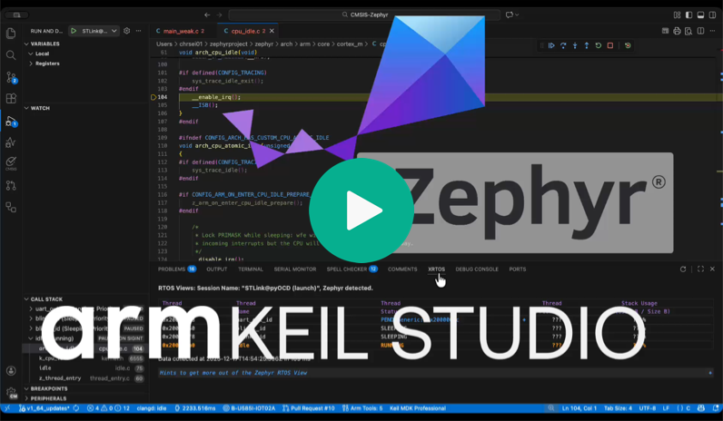

# CMSIS-Zephyr

This repository contains an exemplary CMSIS solution file that can be used to build two Zephyr basic examples on two
different development boards. It can be easily adapted to other boards or examples. It uses Zephyr's `west` build
system to create the executable file for an application and the
[Arm CMSIS Debugger](https://marketplace.visualstudio.com/items?itemName=Arm.vscode-cmsis-debugger) to flash download
and run the image on the target hardware.

> [!NOTE]
> Make sure that you have installed Zephyr as explained in the
> [Keil Studio documentation](https://mdk-packs.github.io/vscode-cmsis-solution-docs/zephyr.html).

## Quick start

- Clone this repository onto your machine.
- Open it in VS Code. It should install required extensions automatically.
- Press the **Manage Solution Settings** button. In the dialog, select the target board and application.
- Press the **Build solution** button to build the example.
- Press the **Load & Debug application** button to start a debug session.

> [!NOTE]
> - Check that the **Arm CMSIS Solution** extension is at least v1.66.0.
> - If you are working under Windows, you will get the error `exec: "west": executable file not found in %PATH%` because in this example the path to the west build system is set up for Linux/Mac. Open the settings of the **Arm CMSIS Solution** extension and change the `PATH` environment variable of the **Workspace** from `$HOME/zephyrproject/.venv/bin` to `$HOME/zephyrproject/.venv/Scripts`.


### Switch to a different board

If you want to run the examples on a different board, simply extend the `zephyr.csolution.yml` file:
- Search for your [development board](https://www.keil.arm.com/boards/) and select it.
- Follow the link to the **Device** and its **CMSIS Pack** (DFP) and copy the text in the **Add to CMSIS Solution** box into the 'zephyr.csolution.yml' file into the 'packs:' list.
- Go back to the board page and follow the link to the **CMSIS Pack** (BSP). Again, copy the text in the **Add to CMSIS Solution** box into the 'zephyr.csolution.yml' below the DFP.
- Add a new [Target Type](https://open-cmsis-pack.github.io/cmsis-toolbox/YML-Input-Format/#target-types) and specify the board name after the '- type' token.
- Specify the board vendor and boardname as well as the device vendor and the device name. Use the names from the CMSIS board and device pages.

```yml
  # List the packs that define the device and/or board.
  packs:
    - pack: Vendor::DFP
    - pack: Vendor::BSP

  # List different hardware targets that are used to deploy the solution.
  target-types:
    - type: SpecifyName
      board: Vendor::Boardname
      device: Vendor::Devicename
```

If your development board's [CMSIS board name](https://www.keil.arm.com/boards/) and
[Zephyr board name](https://docs.zephyrproject.org/latest/boards/index.html#) do not match, you need to add the correct Zephyr board name with the variable `west-board:`. This variable may contain the `Board_Name`, or the `Board_Name/SoC_Name` or the `Board_Name/SoC_Name/Core_Name`, depending on the complexity of the board and SoC. See the Zephyr website for more details.

```yml
  target-types:
    - type: B-L475-IOT01A
      board: STMicroelectronics::B-L475E-IOT01A
      device: STMicroelectronics::STM32L475VGTx
      variables:
        - west-board: disco_l475_iot1
```

> [!NOTE]
> Make sure to delete the previous `/out` and `/tmp` directories before saving the updated `*.csolution.yml` file,
> otherwise the solution might not load correctly.

## Use the Zephyr Terminal in CMSIS View


Keil Studio includes a built-in **Zephyr Terminal** that runs `west` commands directly inside the IDE. When the terminal opens, it automatically sets the example build folder as the working directory and configures the Zephyr environment.

Example `west` commands:

```bash
# Build the project
west build

# Open GUI configuration
west build -t guiconfig

# Generate RAM report
west build -t ram_report
```

## Introduction video

[](https://armkeil.blob.core.windows.net/developer/Files/videos/KeilStudio/CMSIS-Zephyr.mp4)
