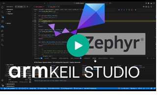
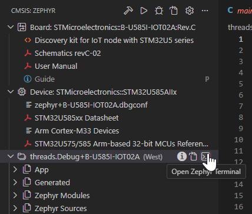

# Using Zephyr with Keil Studio and Arm CMSIS Debugger

[](https://armkeil.blob.core.windows.net/developer/Files/videos/KeilStudio/CMSIS-Zephyr.mp4 "Overview of Zephyr capabilities in Keil Studio")

This repository contains two basic Zephyr examples configured in the [`zephyr.csolution.yml`](./zephyr.csolution.yml) file for multiple development boards. It uses [Keil Studio](https://marketplace.visualstudio.com/items?itemName=Arm.keil-studio-pack) and the Zephyr `west` build system to generate the application image.

The [Arm CMSIS Debugger](https://marketplace.visualstudio.com/items?itemName=Arm.vscode-cmsis-debugger) provides kernel-aware debugging and views for device peripherals, including the interrupt system. It is used to download and run the application on target hardware.

pyOCD supports with RTT and SystemView the analysis of the run-time behavior in CI workflows.

Overall, Zephyr development is simplified by managing different build configurations, using an intuitive project tree, supporting multi-core configurations, and providing smart editor features such as code completion.

## Quick start

1. Install [Keil Studio for VS Code](https://marketplace.visualstudio.com/items?itemName=Arm.keil-studio-pack) from the VS Code marketplace.
2. Follow the [Zephyr Getting Started Guide](https://docs.zephyrproject.org/latest/develop/getting_started/index.html) and install Zephyr in the directory `$HOME/zephyrproject`.
3. Clone this repository (for example using [Git in VS Code](https://code.visualstudio.com/docs/sourcecontrol/intro-to-git)) or download the ZIP file. Then open the repository folder in VS Code.
4. In VS Code, open the [CMSIS View](https://mdk-packs.github.io/vscode-cmsis-solution-docs/userinterface.html#2-main-area-of-the-cmsis-view) and then the [Manage Solution dialog](https://github.com/Open-CMSIS-Pack/vscode-cmsis-solution#manage-solution-view) to select the target board and one project.
5. In the CMSIS view, use the [Action buttons](https://github.com/ARM-software/vscode-cmsis-csolution?tab=readme-ov-file#action-buttons) to build, load, and debug the example on your hardware.

> [!CAUTION]
> If you see errors during `west build` (for example during `generating a build system`), the `west` installation or `PATH` is likely incorrect. Check [Settings](https://code.visualstudio.com/docs/configure/settings) - **Cmsis-Csolution:** Environment Variables.
>
> - For Windows, set `PATH` to `$HOME/zephyrproject/.venv/scripts`
> - For Mac/Linux, set `PATH` to `$HOME/zephyrproject/.venv/bin`
<!-- -->
> [!TIP]
> For more information, see the [Keil Studio documentation - Work with Zephyr applications](https://mdk-packs.github.io/vscode-cmsis-solution-docs/zephyr.html).

## Add another board

If you use a different board, extend the [`zephyr.csolution.yml`](zephyr.csolution.yml) file with:

```yml
  # List the packs that define the device and/or board.
  packs:
    - pack: Vendor::DFP
    - pack: Vendor::BSP

  # List different hardware targets that are used to deploy the solution.
  target-types:
    - type: SpecifyName
      board: Vendor::Board_name      # Vendor is optional
      device: Vendor::Device_name    # Vendor and Devicename is optional 
```

To find the packs open [https://www.keil.arm.com/boards/](https://www.keil.arm.com/boards/) and search for your board.

- `pack: Vendor::BSP` is listed under CMSIS Pack on the [Board](https://www.keil.arm.com/boards/) page.
- `pack: Vendor::DFP` is listed under CMSIS Pack on the related [Device](https://www.keil.arm.com/devices/) page.

### Board name different in Zephyr and CMSIS Pack

Frequently the [Zephyr board name](https://docs.zephyrproject.org/latest/boards/index.html#) does not match. In this case add the variable `west-board:` as shown below.

Use [Zephyr - Supported Boards and Shields](https://docs.zephyrproject.org/latest/boards/index) and find your board. Under **Supported Features** the `board_name`, `board_name/soc_name` or `board_name/soc_name/core_name` is listed that is the specified with `west-board:` .

```yml
  target-types:
    - type: B-L475-IOT01A
      board: STMicroelectronics::B-L475E-IOT01A
      device: STMicroelectronics::STM32L475VGTx
      variables:
        - west-board: disco_l475_iot1/stm32l475xx
```

## Zephyr Terminal



Keil Studio includes a built-in **Zephyr Terminal** for running `west` commands in the IDE. When you open it, it configures for the selected project with the working directory and Zephyr environment.

**Example `west` commands:**

```bash
# Build the project
west build

# Open GUI configuration
west build -t guiconfig

# Generate RAM report
west build -t ram_report
```

## RTT and SEGGER SystemView

SEGGER Real-Time Transfer (RTT) enables real-time data exchange between a target device and a host debugger without requiring an additional UART interface. RTT also is the transport mechanism used for SystemView.

RTT and SystemView is integrated in Zephyr and enabled in the [`zephyr.csolution.yml`](zephyr.csolution.yml) file with the `west-defs` under the `build-type: Debug-RTT`. RTT and SystemView are currently implemented for CI testing and can be used with pyOCD as shown below. 

**Example invocation for `target-type: STM32H7B3I-DK`:

```bash
pyocd load --cbuild-run <path>\out\zephyr+STM32H7B3I-DK.cbuild-run.yml
pyocd run  --cbuild-run <path>\out\zephyr+STM32H7B3I-DK.cbuild-run.yml
```

The pyOCD `run command` outputs now test messages to the debug console and collects the file `out\zephyr+STM32H7B3I-DK.SVdat` that can be analyzed with [SEGGER SystemView](https://www.segger.com/products/development-tools/systemview/).
