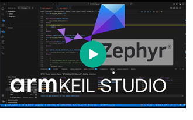
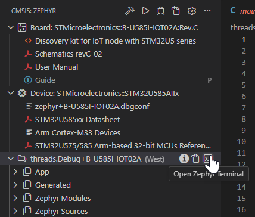

[](https://github.com/Arm-Examples/CMSIS-Zephyr/blob/main/LICENSE)
[](https://github.com/Arm-Examples/CMSIS-Zephyr/actions/workflows/Build_All_Variants.yaml)
[](https://github.com/Arm-Examples/CMSIS-Zephyr/actions/workflows/Build_NUCLEO-H563ZI.yaml)
[](https://github.com/Arm-Examples/CMSIS-Zephyr/actions/workflows/Run_NUCLEO-H563ZI.yaml)

# Zephyr Integration with CMSIS-Toolbox

[](https://armkeil.blob.core.windows.net/developer/Files/videos/KeilStudio/CMSIS-Zephyr.mp4 "Overview of Zephyr capabilities in Keil Studio")

This repository contains two basic Zephyr examples configured in the [`zephyr.csolution.yml`](./zephyr.csolution.yml) file for multiple development boards. It uses the GCC toolchain, [Keil Studio](https://marketplace.visualstudio.com/items?itemName=Arm.keil-studio-pack), and the Zephyr `west` build system to generate the application image.

The [Arm CMSIS Debugger](https://marketplace.visualstudio.com/items?itemName=Arm.vscode-cmsis-debugger) provides kernel-aware debugging and views for device peripherals, including the interrupt system. It is used to download and run the application on target hardware.

pyOCD supports runtime behavior analysis in CI workflows using RTT and SystemView.

Overall, Zephyr development is simplified by managing different build configurations, using an intuitive project tree, supporting multi-core configurations, and providing smart editor features such as code completion.

## CMSIS-Toolbox Integration

Zephyr and West remain responsible for configuring and building the Zephyr application. The [`zephyr.csolution.yml`](./zephyr.csolution.yml) file adds [common project information](https://open-cmsis-pack.github.io/cmsis-toolbox/overview/#common-project-information-for-the-development-workflow) for the selectable application configurations and their target hardware.

CMSIS-Toolbox uses the same common project information in VS Code, command-line, and CI/DevOps workflows. CMSIS Packs provide device and board data that complements the Zephyr build information with programming, run, and debug configuration, peripheral views, and trace configuration. Generated files such as `compile_commands.json` and `*.cbuild-run.yml` connect smart editor features, static code analysis and test tools, target deployment, and trace to the application development workflow without replacing Zephyr or West.

## VS Code quick start

1. Install [Keil Studio for VS Code](https://marketplace.visualstudio.com/items?itemName=Arm.keil-studio-pack) from the VS Code marketplace.
2. [Install upstream Zephyr](#zephyr-installation) and [configure its environment variables](#configure-vs-code).
3. Clone this repository (for example using [Git in VS Code](https://code.visualstudio.com/docs/sourcecontrol/intro-to-git)) or download the ZIP file. Then open the repository folder in VS Code.
4. In VS Code, open the [CMSIS View](https://mdk-packs.github.io/vscode-cmsis-solution-docs/userinterface.html#2-main-area-of-the-cmsis-view) and then the [Manage Solution dialog](https://github.com/Open-CMSIS-Pack/vscode-cmsis-solution#manage-solution-view) to select the target board and one project.
5. In the CMSIS view, use the [Action buttons](https://github.com/Open-CMSIS-Pack/vscode-cmsis-solution#action-buttons) to build, load, and debug the example on your hardware.

> [!TIP]
> If configuration or build errors occur, use **Clean All 'out' and 'tmp' directories** from the CMSIS View menu to remove stale CMake cache files before rebuilding.

## Zephyr installation

The following instructions apply to Linux, macOS, and Windows. Install a supported version of Python 3 and Git before
continuing.

> [!WARNING]
> On Windows, use Python 3.13 or earlier because the `windows-curses` package is not yet available for Python 3.14.

### Create the workspace

- Open a terminal as a regular user. On Windows, use `cmd.exe` for the commands below.

- In any suitable working directory, create a `zephyrproject` directory and change into it:

  ```console
  mkdir zephyrproject
  cd zephyrproject
  ```

- Create a virtual environment. Use the command for your operating system:

  Linux and macOS:

  ```sh
  python3 -m venv .venv
  ```

  Windows:

  ```bat
  python -m venv .venv
  ```

- Activate the virtual environment.

  Linux and macOS:

  ```sh
  source .venv/bin/activate
  ```

  Windows (`cmd.exe`):

  ```bat
  .venv\Scripts\activate.bat
  ```

  Once activated, the shell prompt is prefixed with `(.venv)`. Activate the environment again whenever you open a
  new terminal. Run `deactivate` to leave it.

- Install west. After activation, `python` refers to the virtual environment on every supported operating system:

  ```console
  python -m pip install west
  ```

- Get the upstream Zephyr source code and its modules:

  ```console
  west init -m https://github.com/zephyrproject-rtos/zephyr.git
  west update
  ```

- Install the Python dependencies required by Zephyr:

  ```console
  python -m pip install -r zephyr/scripts/requirements.txt
  ```

### Configure VS Code

The CMSIS Solution extension needs the Zephyr workspace and virtual environment paths when it runs `west`.

1. In VS Code, open **Settings** and search for **Cmsis-Csolution: Environment Variables**.
2. Select the **User** or **Workspace** setting and choose **Add Item** for each variable below. Replace the example
   prefix with the absolute path to your `zephyrproject` directory.

   | Variable | Linux and macOS | Windows |
   |---|---|---|
   | `ZEPHYR_BASE` | `/work/zephyrproject/zephyr` | `C:\work\zephyrproject\zephyr` |
   | `PATH` | `/work/zephyrproject/.venv/bin` | `C:\work\zephyrproject\.venv\Scripts` |
   | `VIRTUAL_ENV` | `/work/zephyrproject/.venv` | `C:\work\zephyrproject\.venv` |

3. Fully restart VS Code so that the extension uses the new environment.

For more information, see [Work with Zephyr applications](https://mdk-packs.github.io/vscode-cmsis-solution-docs/zephyr.html#set-environment-variables).

## Command-line build

Install [CMSIS-Toolbox](https://open-cmsis-pack.github.io/cmsis-toolbox/installation/), the GCC compiler, and the
[Zephyr workspace described above](#zephyr-installation). Ensure that the Zephyr virtual environment is active, then
run for example:

```bash
cbuild zephyr.csolution.yml --packs --active NUCLEO-H563ZI
```

The command uses the same common project information as VS Code and invokes West to build the selected Zephyr application. Refer to [West Build System Integration](https://open-cmsis-pack.github.io/cmsis-toolbox/build-overview/#west-build-system-integration) for details.

> [!CAUTION]
> If you see errors during `west build` (for example during `generating a build system`), the `west` installation or `PATH` is likely incorrect. Check [Settings](https://code.visualstudio.com/docs/configure/settings) - **Cmsis-Csolution:** Environment Variables.
> Verify that the values match the paths in [Configure VS Code](#configure-vs-code).
<!-- -->
> [!TIP]
> For more information, see the [Keil Studio documentation - Work with Zephyr applications](https://mdk-packs.github.io/vscode-cmsis-solution-docs/zephyr.html).

## Add another board

If you use a different board, extend the [`zephyr.csolution.yml`](zephyr.csolution.yml) file with:

```yml
  # List the packs that define the device and/or board.
  packs:
    - pack: Vendor::DFP
    - pack: Vendor::BSP

  # List different hardware targets that are used to deploy the solution.
  target-types:
    - type: SpecifyName
      board: Vendor::Board_name      # Vendor is optional
      device: Vendor::Device_name    # Vendor and device name are optional
```

To find the packs, open [https://www.keil.arm.com/boards/](https://www.keil.arm.com/boards/) and search for your board.

- `pack: Vendor::BSP` is listed under CMSIS Pack on the [Board](https://www.keil.arm.com/boards/) page.
- `pack: Vendor::DFP` is listed under CMSIS Pack on the related [Device](https://www.keil.arm.com/devices/) page.

### Board name different in Zephyr and CMSIS Pack

Frequently the [Zephyr board name](https://docs.zephyrproject.org/latest/boards/index.html#) does not match. In this case add the variable `west-board:` as shown below.

Use [Zephyr - Supported Boards and Shields](https://docs.zephyrproject.org/latest/boards/index) and find your board. Under **Supported Features** the `board_name`, `board_name/soc_name` or `board_name/soc_name/core_name` is listed; this is what you specify with `west-board:`.

```yml
  target-types:
    - type: B-L475-IOT01A
      board: STMicroelectronics::B-L475E-IOT01A
      device: STMicroelectronics::STM32L475VGTx
      variables:
        - west-board: disco_l475_iot1/stm32l475xx
```

## Zephyr Terminal



Keil Studio includes a built-in **Zephyr Terminal** for running `west` commands in the IDE. When you open it, it configures the working directory and Zephyr environment for the selected project.

**Example `west` commands:**

```bash
# Build the project
west build

# Open GUI configuration
west build -t guiconfig

# Generate RAM report
west build -t ram_report
```

## RTT and SEGGER SystemView

SEGGER Real-Time Transfer (RTT) enables real-time data exchange between a target device and a host debugger without requiring an additional UART interface. RTT is also the transport mechanism used for SystemView.

RTT and SystemView are integrated in Zephyr and enabled in the [`zephyr.csolution.yml`](zephyr.csolution.yml) file with the `west-defs` under the `build-type: Debug-RTT`. RTT and SystemView are currently used for CI testing and can be used with pyOCD as shown below.

**Example invocation for `target-type: STM32H7B3I-DK`:**

```bash
pyocd load --cbuild-run <path>\out\zephyr+STM32H7B3I-DK.cbuild-run.yml
pyocd run  --cbuild-run <path>\out\zephyr+STM32H7B3I-DK.cbuild-run.yml
```

The pyOCD `run` command now outputs test messages to the debug console and collects the file `out\zephyr+STM32H7B3I-DK.SVdat`, which can be analyzed with [SEGGER SystemView](https://www.segger.com/products/development-tools/systemview/).

## CI Test Automation

This repository demonstrates a hybrid CI approach: build steps run on GitHub-hosted runners, while hardware execution runs on a self-hosted Raspberry Pi 5 (RPi5) runner connected to a NUCLEO board.

The [CI workflows](./.github/workflows) provide full build coverage and hardware-in-the-loop (HIL) testing:

- [Build_All_Variants.yaml](./.github/workflows/Build_All_Variants.yaml) builds every project, build type, and supported target combination.
- [Build_NUCLEO-H563ZI.yaml](./.github/workflows/Build_NUCLEO-H563ZI.yaml) compiles the selected Zephyr application and produces build outputs that can be consumed by the run workflow.
- [Run_NUCLEO-H563ZI.yaml](./.github/workflows/Run_NUCLEO-H563ZI.yaml) executes on the self-hosted RPi5 runner and uses an attached debug probe to download and execute the image on the target board.

The run workflow uses pyOCD to flash and run the application. To avoid duplicating board configuration in multiple places, the workflow relies on the generated `*.cbuild-run.yml` file for target information and uses the ID of the connected debug adapter to select the correct probe. Refer to the [CMSIS-Toolbox - Run and Debug Configuration](https://open-cmsis-pack.github.io/cmsis-toolbox/build-overview/#run-and-debug-configuration) for more information.

In the [GitHub Actions view of Run_NUCLEO-H563ZI.yaml](https://github.com/Arm-Examples/CMSIS-Zephyr/actions/workflows/Run_NUCLEO-H563ZI.yaml), you can review the test results:

- The application output is visible in the action log (for example via RTT-based console output).
- The workflow uploads a SEGGER SystemView trace (`*.SVdat`) as an artifact. This execution trace can be downloaded and analyzed offline.

See [Setup Self-Hosted GitHub Runner on Raspberry Pi 5](https://github.com/Arm-Examples/.github/blob/main/profile/RPI_GH_Runner.md) for details on configuring the self-hosted runner. It explains installing pyOCD and the required DFP and BSP packs for connecting to the target hardware.
